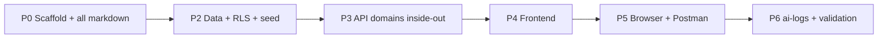

# Plan — multi-tenant pulse surveys

Implementation plan for this repo. Frozen decisions live in [SPEC.md](SPEC.md). Outcomes and AWS notes live in [SOLUTION.md](SOLUTION.md).

**Status:**

Local run: `git clone` → `npm install` → `npm run setup` → `npm run dev`.

## Goal

Weekly pulse surveys per organization with strict tenant isolation, table-driven RBAC, per-org module entitlements, JWT + session-table revoke, soft-delete users, and grouped activity that never logs secrets. Simplest design that satisfies the contract — no speculative machinery.

## Coverage

| Item | Plan |
|---|---|
| AI coding tool; AGENTS.md; **PLAN.md at repo root**; spec-before-code; SOLUTION.md AI workflow + validation; ai-logs/ | All markdown in P0, including this file; P6 only adds ai-logs + validation notes |
| TypeScript, NestJS, PostgreSQL, React | `apps/api` + `apps/web` |
| Run locally, no IdP / paid cloud | Docker Compose Postgres; seeded **email + password** login |
| User belongs to exactly one org | `User.orgId` required |
| Manager + Member | Seeded MANAGER + MEMBER; SUPER_ADMIN + custom roles are additive. No ADMIN — managers add other managers; super admin creates orgs |
| Org data isolation | App `orgId` + RLS; two seeded tenant orgs |
| Surveys, max 3 questions, rating 1–5 + yes/no | Validation + schema |
| Manager creates surveys for own org | `POST/GET /surveys`. Manage in this slice = create + list + `isActive` on create. No edit/deactivate endpoint (known gap) |
| Member: one response per active week | Unique `(surveyId, userId, weekStart)` + idempotent replay |
| Weekly summary | `GET /surveys/:id/summary`; ISO week (Monday) |
| Seed ≥2 orgs, users per role | System + Northwind Retail + Apex Mining |
| React: member submit, manager summary, two-org demo, local login | Routes + email/password form. Organization **name** always visible and required |
| Organization names unique, case-insensitive | Unique index on `lower(name)` |
| Emails unique per org, case-insensitive | Partial unique `(orgId, lower(email)) WHERE deletedAt IS NULL`; stored lowercase |
| SOLUTION.md: trade-offs, gaps, next steps | P0 decisions; P6 validation |
| AWS: deploy, org logos, tenancy/security/scale | Design only in SOLUTION.md / docs/flows.md |
| README, progressive commits, GitHub | README in P0 |

Extras (keep the slice tight; shipped after the happy path): table-driven RBAC + custom roles + modules, JWT+session + org session cap, soft-delete, async activity, ports/adapters, method allowlist, rate limits, error envelope, pagination, Postman/Newman, user-level RLS.

## Auth: JWT + Session table

JWT carries identity so guards do not re-fetch user/role/permissions. The Session table keeps **state** so a JWT can still be revoked, expired, and capped.

```
JWT { sub, orgId, roleId, roleName, permissions[], jti, iat, exp }  // HS256
Session { id = jti, userId, orgId, tokenHash (sha256), expiresAt, revokedAt? }
```

Request path: verify signature/`exp`/`alg` locally → one Session lookup by `jti` → 401 if missing, expired, revoked, or user `deletedAt` → claims drive tenant + permission guards.

### Login

`POST /auth/login` `{ email, password, organization }` → `{ token, expiresAt, user, org }`. Never return `passwordHash`.

- Identity is `users.id`. Email is not global: unique among **active** users per org, ignoring case.
- The same address in two orgs is two accounts. `organization` is the org **name** (case-insensitive), not a UUID, and is **always required**.
- The login form always shows Organization. Missing or blank → 422 schema (`VALIDATION_FAILED`) for every request — not a signal that the email exists in multiple orgs.
- Unknown email, wrong password, or unknown/mismatched org name → dummy verify + 401 `Invalid credentials` (no email oracle, no org list, no multi-org oracle).
- Passwords stored as scrypt (`IPasswordHasher`); `timingSafeEqual` on verify.
- `GET /auth/users` is not public.
- TTL 24h. Login issues a new JWT (not idempotent). Org session cap still prevents pile-up.

Logout: `POST /auth/logout` sets `revokedAt` on `jti` (already revoked → 200 no-op).

Concurrent cap is per organization: `Organization.maxSessionsPerUser` default **1**, range 1–20. Login evicts oldest active sessions in the same transaction as insert + `User.lastLogin`.

`PATCH /orgs/:id/settings` `{ maxSessionsPerUser }`: manager own org only; super admin any org. Lowering the cap revokes excess sessions in the same transaction.

Soft-delete user: `deletedAt` + revoke **all** sessions in one transaction.

Known gap: permission changes apply on the next login (JWT is a snapshot).

## Ports and adapters

Controllers → services → repository **ports**. Only adapters import Prisma / `jsonwebtoken` / `console`. Nest binds adapters as singleton providers.

Ports: `ILogger`, `ITokenSigner`, `ITokenHasher`, `IPasswordHasher` (scrypt), `IClock`, `IActivityEmitter`, `I<Domain>Repository`. Unit tests bind in-memory fakes.

## HTTP pipeline

Method allowlist → **rate limit** → token middleware → permission middleware → module check → DTO schema → handler.

Public: `POST /auth/login`, `GET /health`. Errors: `{ error: { code, message, details? } }`. No stack, SQL, tokens, or env. Unknown verbs → 405. Invalid schema → 422. Over rate limit → 429 `RATE_LIMITED` with `Retry-After`. All routes except OPTIONS share a per-IP window (default 100 / 60s); login uses a tighter window (default 10 / 60s).

List endpoints: `{ items, page, limit, total }`. `page` ≥ 1 default 1; `limit` 1–100 default 20.

## Isolation

App always filters `orgId` from the verified JWT. Member-owned rows also filter `userId = jwt.sub`. RLS on `pulse_app` is fail-closed.

- Org policy: `org_id = current_org` (unset → zero rows).
- User-owned (sessions, responses, answers, activity): org match **and** (`user_id = current_user` OR `is_org_reader`).
- `is_org_reader` from permissions, never role names: intersection with `{ summary:read, activity:read, users:create, users:delete, orgs:update, orgs:create, modules:manage }`.
- Custom roles (`roles.orgId` set): listed, assigned, and deleted only in the creating org. System roles (`orgId` null) are global and cannot be deleted.
- Privileged client: login lookup, seed, migrations, super-admin cross-org CRUD, async activity inserts.

## ACID and activity

`withTenant` = one interactive transaction + `set_config`. Throw rolls back. Activity is **not** in that transaction: emit after commit, do not await persist. In-process `setImmediate` queue. Crash between commit and drain can drop one log (outbox/SQS listed as next step).

Metadata allowlist: `{ entityType, entityId, name }` only.

## Idempotency

| Flow | Key | Replay |
|---|---|---|
| Submit response | `(surveyId, userId, weekStart)` | Same answers → 200 existing, no second activity. Different answers → 409 |
| Soft-delete user | `userId` | Already deleted → 200 no-op |
| Logout | `jti` | Already revoked → 200 no-op |
| PUT org modules | org + set | Same set → 200, no extra activity |
| PATCH session cap | org + value | Same value → 200 |
| Create role | unique `(orgId, name)` | Clash → 409 |
| Create user | unique active `(orgId, lower(email))` | Clash → 409 |
| Create org | unique `lower(name)` | Clash → 409 |
| Delete custom role | role id | Holders (including soft-deleted, FK) → 409. Missing → 404. System → 403 |

## Frontend

React Router, `AuthContext` (no prop drilling), `ErrorBoundary` around the route outlet **and** each data panel (`Panel`). `useFetch` never throws into render.

- `/login` — email, password, and organization name (always visible and required).
- `/survey` — `responses:submit`
- `/summary` — `summary:read`
- `/roles` — `roles:create` (create + remove custom roles)
- `/activity` — `activity:read`
- `/orgs` — `orgs:create`
- `/settings` — `orgs:update`
- `/people` — `users:create`

## Access model

- Permissions catalog by domain. No `orgs:read` or `roles:assign`.
- System roles: SUPER_ADMIN (all), MANAGER (surveys, summary, activity, roles, users including other managers, `orgs:update`), MEMBER (`responses:submit`, `surveys:read`).
- Custom roles: org-scoped subset. Superset guard on create and assign.
- `DELETE /roles/:id` uses `roles:create`. Apex cannot see or delete Northwind custom roles.
- Modules: Org B seed has no `summary` → 403 `FORBIDDEN_MODULE`.

## Data model notes

- `Organization.name` unique on `lower(name)`.
- `User.email` stored lowercase; partial unique `(orgId, lower(email)) WHERE deletedAt IS NULL`.
- `User.passwordHash`, `createdAt`, `updatedAt`, `updatedBy`, `lastLogin`, `deletedAt`.
- `Organization.maxSessionsPerUser` default 1, 1–20.
- Unique response `(surveyId, userId, weekStart)`.
- SQL parameterized only. No concatenated `$queryRaw`.

Seed: System (Ava, cap 1); Northwind Retail (Maya manager, Liam + Nora members, Jordan Team Lead, all modules, cap 1); Apex Mining (Priya manager, Owen + Elise, **no summary**, cap 1). Seed password `Pulse!dev1`.

## Implementation sequence



| Phase | What |
|---|---|
| P0 | Scaffold + **every** markdown file: AGENTS, SPEC, PLAN (this file), README, SOLUTION, docs/architecture, docs/flows |
| P2 | Prisma schema, RLS, seed |
| P3 | Kernel → access → admin → surveys/responses/summary → activity → e2e |
| P4 | React Router, AuthContext, per-widget ErrorBoundary |
| P5 | Postman/Newman + browser walkthrough |
| P6 | `ai-logs/` + SOLUTION validation notes |

P3f e2e must cover: cross-org isolation, member-to-member isolation, RBAC, module gates, idempotency, 405, 422, 429, expired/revoked JWT, session cap, manager cannot patch another org, role delete 409/403/404, mixed-case email, duplicate org name, shared-email login with organization name, missing organization 422 for unique and shared emails.

## API (see SPEC.md for the frozen table)

Public: `POST /auth/login`, `GET /health`.

`POST /auth/login` `{ email, password, organization }`. `DELETE /roles/:id` (`roles:create`). Lists paginated. Rate limits on all routes.

## AWS (design only)

CloudFront + S3 web; WAF → ALB → ECS Fargate API (no API Gateway); RDS Postgres Multi-AZ; SQS workers; SES. Org logos: presigned S3 PUT, CloudFront signed GET. Same `IActivityEmitter` port produces to SQS off the request path. Observability: CloudWatch Logs (JSON) + Metrics/alarms + OpenTelemetry/ADOT → X-Ray across API and workers. Details in [SOLUTION.md](SOLUTION.md) and [docs/flows.md](docs/flows.md).

## Threat model (STRIDE-lite)

Assets: JWTs, session hashes, tenant data, role grants, audit trail.

Threats: replayed JWT, `alg=none`, password stuffing / email oracle, multi-org enumeration via a hidden organization field, privilege escalation via custom roles, secrets in logs/errors, cross-tenant or cross-user reads, verb smuggling.

Mitigations: hashed tokens, scrypt + dummy verify + generic 401, organization **always** required (no 422 that reveals a shared email), per-IP rate limits (tighter on login), revoke/expiry/org cap, token then permission middleware, method allowlist, DTO whitelist, error filter, activity allowlist, soft-delete + session revoke, RLS + app `orgId`, case-insensitive unique names/emails.

Residual: JWT permission snapshot until re-login; demo secret is local-only; async activity can drop one row on crash.

## Repo layout

```
multitenant/
├── PLAN.md, README.md, SPEC.md, SOLUTION.md, AGENTS.md
├── docs/architecture.md, docs/flows.md
├── postman/, ai-logs/
└── apps/api, apps/web
```

Layer rule: controllers never call repositories. Services never import Prisma, `jsonwebtoken`, or `console`.
