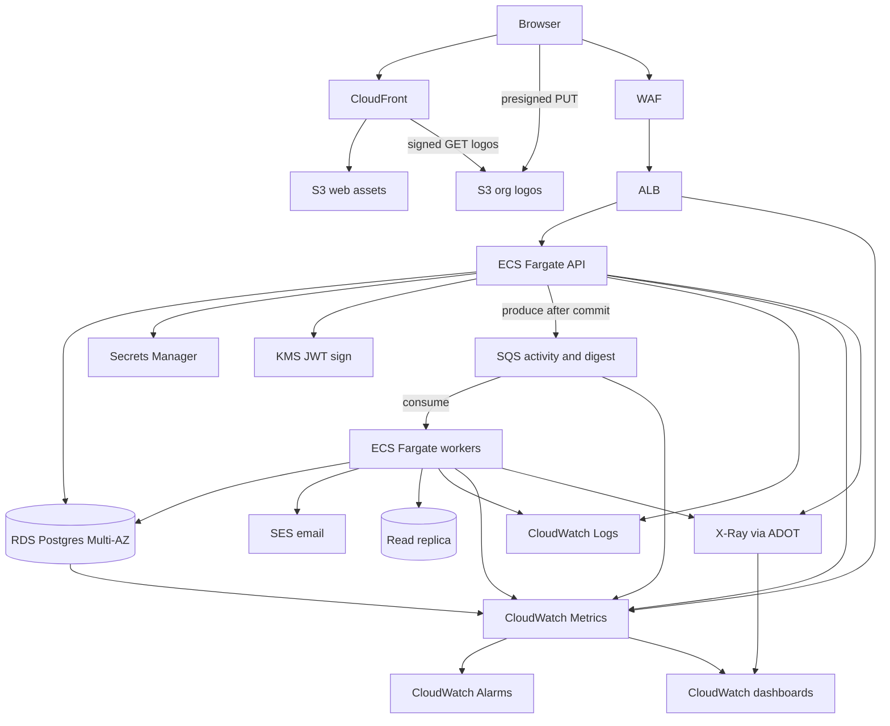

# Solution notes

## Week definition

**ISO calendar week, Monday start.** A unique `(surveyId, userId, weekStart)` constraint makes a second response for the same week impossible at the database, not only in application code.

## Isolation

Hybrid: application `orgId` (JWT + Prisma extension) and PostgreSQL RLS on `pulse_app`.

Login is by **email + password + organization name**. Email is not a global identity: unique among active users per `orgId`, ignoring case. Two tenants may share an address as two users with separate sessions and JWTs. Organization is always required on login (and always shown on the form) so a missing field cannot reveal that an address exists in more than one org. Organization names are unique ignoring case. Passwords are stored as scrypt hashes and never returned.

- Org policy on every tenant table: `org_id = current_org` (fail-closed if unset).
- User policy on responses, answers, sessions, activity: org match and (`user_id = current_user` or `is_org_reader`).
- `is_org_reader` is derived from permissions so SUPER_ADMIN and MANAGER are not blocked from summary, user delete, or session revoke.
- Custom roles are org-owned: listed, assigned, and deleted only in the creating org. System roles (`orgId` null) are global and cannot be deleted. Super-admin user create still checks `role.orgId` against the target org so a guessed UUID cannot attach another tenant's role.
- Cross-tenant admin uses the privileged client.

## Auth

JWT (HS256) carries `sub`, `orgId`, `roleId`, `roleName`, `permissions`, `jti`. The `Session` table stores `jti`, `tokenHash` (sha256 of the JWT), `expiresAt`, `revokedAt`. Verify signature locally, then one `jti` lookup.

`Organization.maxSessionsPerUser` defaults to **1** (1–20). Login evicts the oldest session when at cap. `User.lastLogin` is updated in the same transaction.

Permission changes apply on the next login (JWT is a snapshot).

Every route except OPTIONS is rate-limited per client IP (in-process fixed window). Default 100 requests / 60s; `POST /auth/login` 10 / 60s. Over limit → 429 `RATE_LIMITED` plus `Retry-After`. Behind ALB, `trust proxy` uses the first forwarded hop. Multi-instance later: same counters in Redis; no Redis on the request path in this slice.

## ACID

`withTenant` is one interactive transaction for business rows. Throw rolls back. Repositories receive the `tx` client and do not nest transactions.

Activity is **not** in that transaction. After commit the service calls `IActivityEmitter.emit` and does not await persist. An in-process queue drains with `setImmediate`. A crash between commit and drain can drop one log.

## Ports

Services depend on `ILogger`, `ITokenSigner`, `ITokenHasher`, `IPasswordHasher`, `IClock`, `IActivityEmitter`, and domain repositories. Nest singleton adapters bind the concrete Prisma / JWT / console implementations.

## Known gaps / next steps

- No survey edit/deactivate endpoint (create + `isActive` on create only).
- No org soft-delete.
- JWT permission snapshot until re-login; add refresh or short TTL.
- Activity outbox / SQS if the process must not drop a log.
- OIDC instead of password login.
- Schema-per-tenant only if an enterprise tier needs it.

## AWS (design only)

Local stays a modular monolith: activity is an in-process `setImmediate` queue. On AWS the same `IActivityEmitter` port publishes to **SQS**. Workers consume. The HTTP request still returns after commit; it does not wait for persist or email.

| Piece | Choice | Why |
|---|---|---|
| Web | S3 + CloudFront | Static Vite build; no origin compute |
| API | ECS Fargate + ALB | Same Nest process as local; scale tasks, not a rewrite |
| DB | RDS PostgreSQL Multi-AZ | ACID + RLS stay the source of truth |
| Logos | Presigned S3 PUT, CloudFront signed GET | API signs only; never proxies bytes |
| Async | SQS + ECS Fargate workers | Replaces in-process drain; survives API crash |
| Mail | SES | Weekly pulse reminder and activity digest |
| Secrets | Secrets Manager + KMS RS256 | No long-lived HS256 in task env |
| Logs | CloudWatch Logs | Structured JSON from API and workers; correlate with `trace_id` / `request_id` |
| Metrics | CloudWatch Metrics + Container Insights | RED on API routes; USE on RDS / SQS / ECS; ALB 5xx and latency |
| Traces | OpenTelemetry → ADOT sidecar → X-Ray | Spans across HTTP, Prisma, SQS produce/consume; W3C `traceparent` on queue messages |
| Alerting | CloudWatch Alarms → SNS | Page on sustained 5xx / p99 / SQS age / RDS connections — not on every warn log |

**Observability (design).** Three pillars, same ports locally (`ILogger` today; swap to structured JSON + OTel exporters on AWS):

1. **Logging** — JSON to CloudWatch Logs (one log group per service: `pulse-api`, `pulse-activity`, `pulse-digest`). Every line carries `trace_id`, `request_id`, `orgId` where present. Never tokens, hashes, passwords, or emails. ALB access logs optional to S3 for forensics.
2. **Metrics** — Container Insights on Fargate; app RED counters/histograms (`route`, `method`, `status_class` only — no user ids); USE on RDS (CPU, connections), SQS (ApproximateAgeOfOldestMessage, depth), ECS (CPU/memory). Target SLOs: availability and p99 latency on login / submit / summary.
3. **Tracing** — ADOT collector as a sidecar; Nest instruments HTTP and Prisma; SQS messages carry `traceparent` so worker spans continue the login/submit trace. Sample ratio in prod; always keep error traces. X-Ray service map for API → RDS / SQS → workers.

ALB `/health` stays the liveness target. A `/ready` probe (design) checks RDS before taking traffic. Full picture also lives in [docs/flows.md](docs/flows.md).

**Produce / consume (design).** After `withTenant` commits, the API produces a small allowlisted message `{ orgId, userId, group, action, entityType, entityId, name }` to SQS. It does **not** await the worker. Two consumers:

1. **Activity writer** — insert `ActivityLog` on the privileged client (same allowlist as today). Idempotent on `(orgId, userId, action, entityId)` or a message `id`.
2. **Digest / email** — EventBridge weekly rule (Monday after ISO week close) or a `digest.requested` message. Worker reads the replica, builds a per-manager completion digest, sends via SES. No secrets or raw answers in the mail.

Transactional outbox is the next hardening if we must not drop a produce after commit. First hardening around the edge: OIDC, WAF, KMS signer, read replicas for summary and digest, ADOT + alarms.

## Threat model (STRIDE-lite)

- Assets: JWTs, session hashes, tenant survey/response data, role grants, audit trail.
- Threats: replayed JWT, `alg=none`, password stuffing / email oracle, multi-org enumeration via a delayed organization field, privilege escalation via custom roles, secrets in logs/errors, cross-tenant or cross-user reads, verb smuggling.
- Mitigations: hashed tokens, scrypt passwords + dummy verify + generic 401, organization always required, per-IP rate limits (tighter on login), revoke/expiry/org cap, token then permission middleware, method allowlist, DTO whitelist, error filter, activity allowlist, soft-delete + session revoke, RLS + app `orgId`.
- Residual: demo JWT secret is local-only; async activity can drop one row on crash; in-process rate counters are per instance.

## AI workflow

Built in Cursor. Planning and code started from written [PLAN.md](PLAN.md) at the repo root, [SPEC.md](SPEC.md), [AGENTS.md](AGENTS.md), and this file. The **agent proposed** much of the work sequence (scaffold → schema/RLS → kernel → domains → tests → UI → Postman → browser hardening) and filled unspecified details with assumptions. The **human owned the plan**: edited it, enforced the initial requirements, timeboxed what stayed in-slice vs design-only, and accepted or invented follow-on requirements when real usage demanded them.

### Agent vs human

| Who | What |
|---|---|
| **Cursor agent** | Drafted PLAN phases and many implementation assumptions; scaffold; Prisma schema + RLS + seed; Nest kernel (JWT+session, `withTenant`, ports/adapters, rate limits, error envelope); domain services; unit/e2e/Postman; React SPA shell; AWS/observability **design** notes; code fixes when the human reported browser or flow gaps |
| **Human (author)** | Initial requirements and product intent; **revised the plan** when agent assumptions drifted; decided sequence priority and what was out of scope / timeboxed; continuous **browser walkthroughs** (Ava / Maya / Priya / Liam / Apex members); compared flows to expected behavior; introduced **new requirements mid-build** only when needed (necessity + timebox); directed corrections until UI and API matched the contract |

**Plan and requirements (human-steered)**

- Agent assumptions (stack layout, phase order, “extras” like custom roles/modules, session cap, ports/adapters) were accepted, trimmed, or rewritten in PLAN/SPEC/AGENTS — not left as silent agent defaults.
- **Initial requirements** stayed the north star (tenant isolation, manager/member pulse, two-org demo, local login, summary, activity without secrets).
- **Emergent requirements** during work (examples: organization always on login + rate limits; one active survey on create; question fields on create UI; hide disabled modules from the DOM; thank-you / already-completed UX; summary charts) were added because browser QA or correctness needed them, within the same timebox — not a second product.
- Explicitly **timeboxed out** of the slice: AWS deploy/runtime (design only), survey edit/deactivate API, speculative infra.

Human reviews were not a single sign-off at the end. They were repeated while testing in the browser: create/login as each role, submit responses, read summaries, toggle org modules, create surveys with real questions, and check cross-tenant visibility. Findings drove agent fixes — examples below.

**Browser-driven corrections (human found → agent fixed)**

- Login always requires organization name (no multi-org email oracle); rate limits on every route.
- Active survey: creating a survey deactivates prior actives; members see the newest active survey.
- Survey create UI: title **and** 1–3 questions (text + type), not hardcoded questions behind a title-only form.
- Disabled org modules: omit nav links and routes from the DOM (refresh `/auth/me` on load/focus) instead of showing `FORBIDDEN_MODULE` error pages.
- Summary charts for completion / rating / yes-no; thank-you and already-completed-this-week member states (smileys / tick-cross answers).
- Apex activity “All groups” no longer 500 when actors are outside the tenant (platform-admin name fallback).
- Leftover e2e injection survey titles no longer pollute Summary (active survey only; test cleans up after itself).
- Surveys created while logged in as Ava land on **System** — tenant managers cannot see them (isolation working as designed; create as Maya/Priya for tenant orgs).

Kept for human judgment throughout (not only “review the diff”): isolation rules (app `orgId` + RLS + `is_org_reader`), session cap, error envelope, activity allowlist, and whether a UI behavior matches the product story.

### Skills and rules used

Cursor routed work through orchestrators, then loaded only the skills that matched the layer being changed. Repo constraints in `AGENTS.md` always won over generic advice.

**Orchestrators**

| Orchestrator | When |
|---|---|
| `software-engineering-orchestrator` | API, Prisma, RLS, auth, tests, AWS design |
| `design-ux-orchestrator` | React SPA: pages, pager, **email/password login**, error fallbacks, survey/summary UX |

**Skills**

| Skill | What it enforced |
|---|---|
| `threat-modeling-global` | STRIDE-lite on JWT, RBAC, tenant isolation, SQS payloads |
| `bug-feature-default-workflow` | Validation, 4xx envelopes, bounds (`page`/`limit`, session cap) |
| `backwards-compatible-scalable` | Pagination envelope; uniqueness lives in the init schema (no follow-up ALTER) |
| `database-architecture` | Hybrid `orgId` + RLS, partial unique `(orgId, lower(email))`, unique `lower(org.name)` |
| `sql-optimization-compatible` | Parameterized Prisma, tenant indexes, no concatenated SQL |
| `software-architecture` | Ports/adapters, domain modules, Fargate workers behind the same activity port |
| `system-design-primer` | ALB not API Gateway, CloudFront for static only, SQS off the request path |
| `sre-observability` | AWS design: RED/USE metrics, structured logs + trace correlation, ADOT/X-Ray, health/ready, actionable alarms |
| `optimal-complexity` | Offset pagination, O(1) role-assignability check |
| `dependency-hygiene-global` | No extra packages for pagination or role isolation |
| `accidental-data-loss-prevention` | Soft-delete users; schema changes land in init while the DB is empty |
| `frontend-standards` | React + TypeScript: `function` components, kebab-case files, `handle*` / `use*` / `is*` names, typed props, no unused imports |
| `essential-design-principles` | Novice-first product UI, loading/error/empty states, keyboard-usable pager; disabled modules hidden from nav/DOM |
| `conventional-logical-commits` | Small feat/fix batches |
| `skills-provenance` | Disclose skills/rules on each change |

**Rules**

| Rule | What it enforced |
|---|---|
| `AGENTS.md` | Tenant `orgId`, `withTenant`, layers, public routes, activity allowlist, e2e gates |
| `security-auto-orchestration` | Load threat modeling without being asked |
| `default-architecture-thinking` | Isolation, indexes, async activity vs request path |
| `global-skills-orchestrators` | Route API vs UI through the matching orchestrator |
| `skills-provenance-footer` | End-of-turn `Applied:` line |
| `pattern-rationale-note` | Why a helper/index was chosen over a heavier alternative |
| User React/TS conventions | Functional React, strict equality, `AuthContext` over a global store, semantic lists/forms |

There is no skill named `react`. The React/TypeScript bar is `frontend-standards`, loaded by `design-ux-orchestrator`. `nextjs-performance` was not used: the web app is Vite + React Router, not Next.js. Shadcn/Tailwind from that skill were not applied; the UI uses the existing CSS in `apps/web/src/styles.css`.

### Validation

Automated checks after the build, plus **human browser QA** that continued through the hardening loop above:

- Unit tests: week helper, pagination, permission subset, password hash, access service (in-memory repo, including role-delete guards), rate-limit window — 25 passed.
- API e2e: health, 405/TRACE, 422 envelope without stack/SQL, wrong-password 401, mixed-case email login, duplicate org name 409, no public `/auth/users`, cross-org 404, Apex `FORBIDDEN_MODULE`, member cannot create surveys, idempotent submit + 409, manager summary, `submittedThisWeek` on active survey, superset guard, custom-role org isolation, role delete 409/403/404, session-cap revoke, logout revoke, settings bounds, manager cannot patch another org cap, expired session 401, per-org emails + missing organization 422, rate-limit 429, invalid answer leaves no leftover row, SQL-looking title stored as text then cleaned up, activity has no token/email material, `/auth/me` returns org modules — e2e suite green when DB is seeded.
- Newman: health, Liam login + active survey, Maya summary + activity, Maya cannot patch Apex session cap, Priya summary module denied — 0 failed.
- Browser (human, localhost:5173 / Vite): signed in as each seeded actor; walked member submit (thank-you / already completed), manager create survey with custom questions, summary charts, roles/people/settings/activity, Ava module toggles (Summary link disappears when `summary` is off), Apex vs Northwind isolation; reported mismatches until flows matched expected functionality.
- Residual observed: JWT is still a permission snapshot; async activity can drop a log on crash; demo secret is local-only; surveys created under System stay on System.
