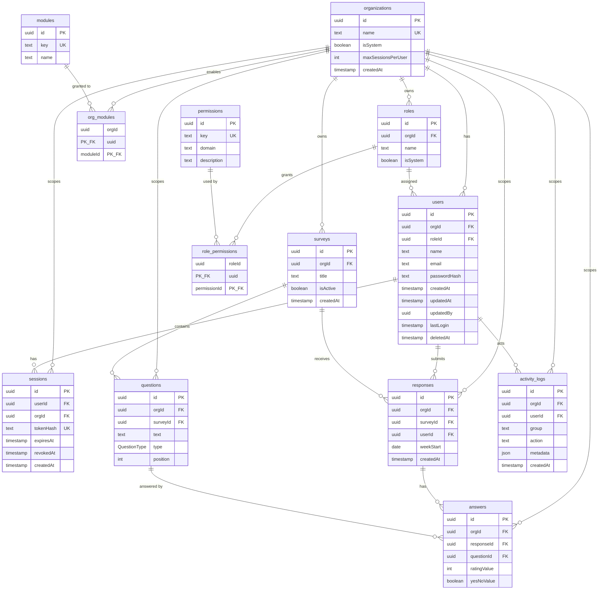

# Database ERD

Source of truth for columns and constraints: [`apps/api/prisma/schema.prisma`](../apps/api/prisma/schema.prisma).  
Generated SQL (tables, indexes, RLS): [`apps/api/prisma/migrations/`](../apps/api/prisma/migrations/).

Mermaid `erDiagram` blocks **render as diagrams on GitHub** (blob view / PRs) and in Cursor/VS Code markdown preview. They do not render in raw text or plain `git show`.

## Entity relationship diagram

## Notes

- `QuestionType` enum: `RATING` | `YES_NO`.
- Tenant isolation: almost every business row carries `orgId`; RLS uses session `set_config` (see `withTenant`).
- Soft-delete users via `deletedAt` — never hard-delete user rows.
- Unique among active users: `(orgId, lower(email))` where `deletedAt IS NULL`.
- One response per member per survey week: unique `(surveyId, userId, weekStart)`.
