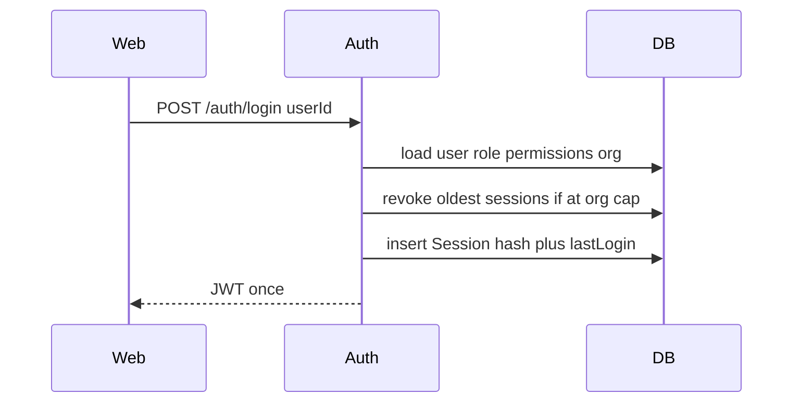
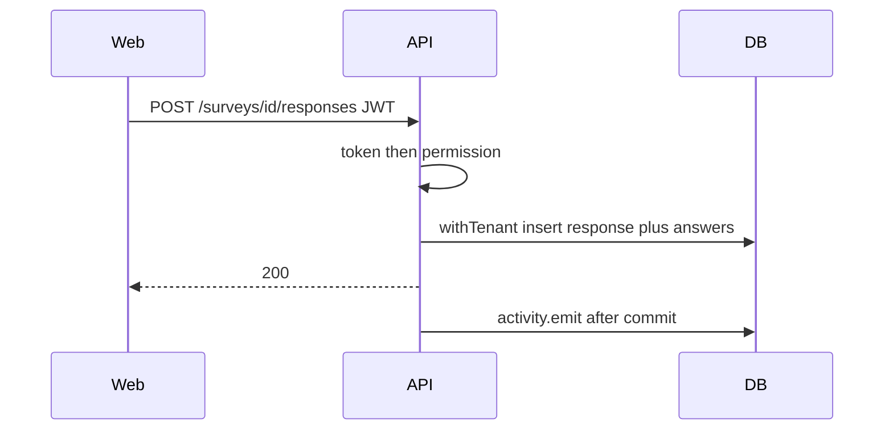
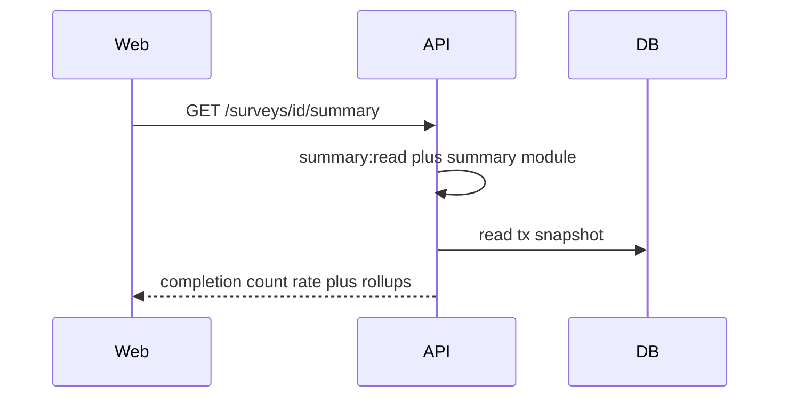
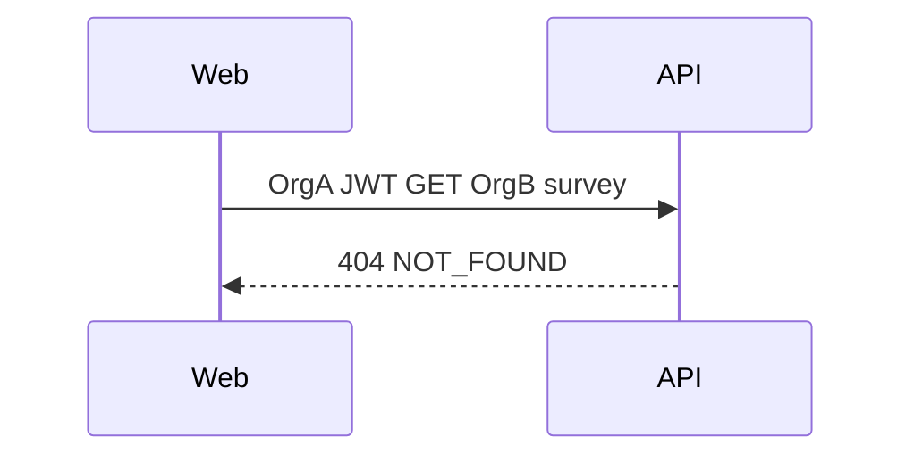
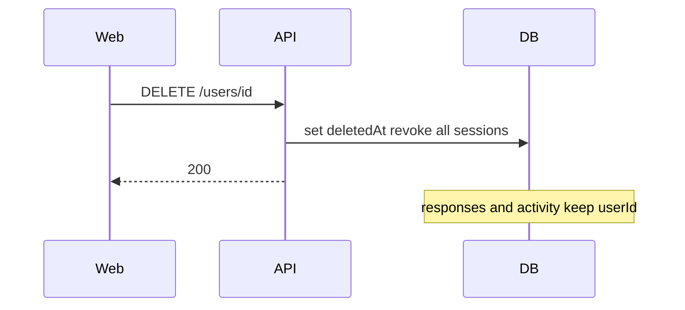

# Flows

## Login and session cap

## Member submits a response

Same week + same answers: 200 existing row, no second activity.
Same week + different answers: 409.

## Manager weekly summary

## Cross-tenant denied

## Soft-delete user

