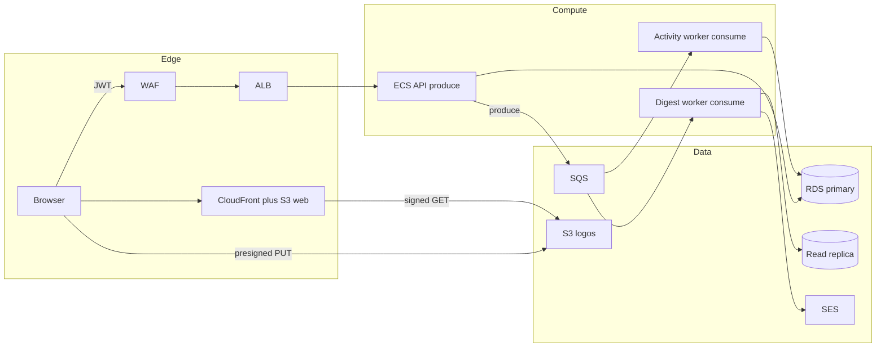
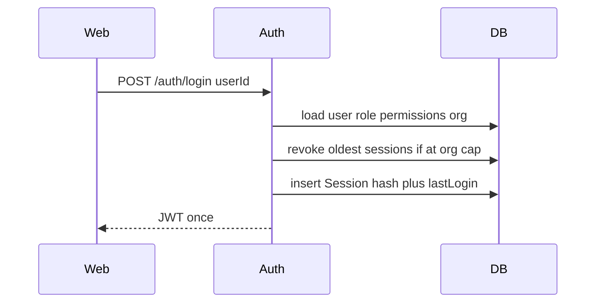
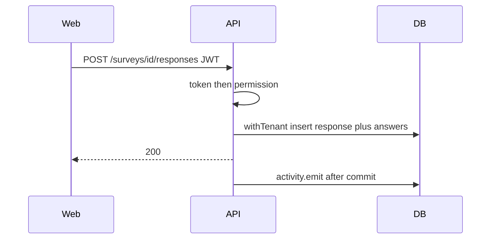
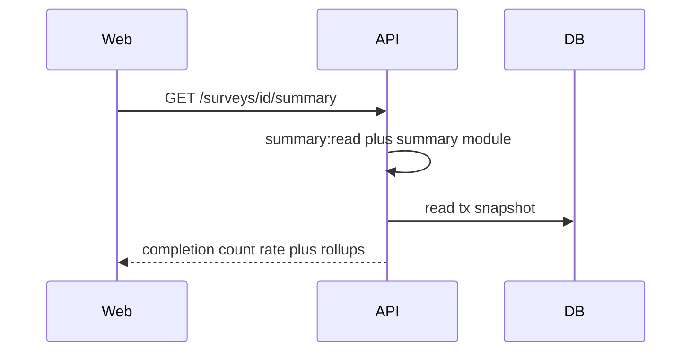
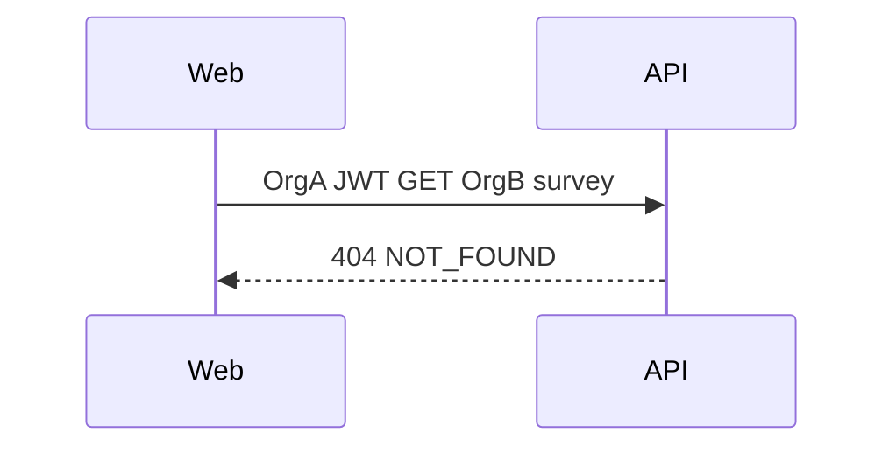
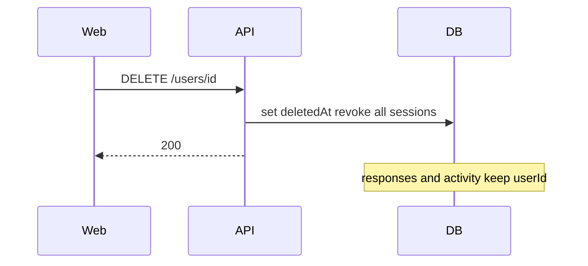
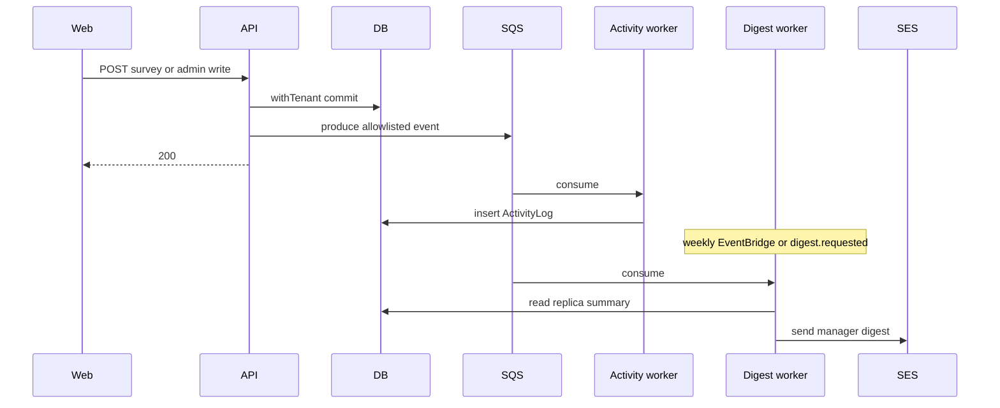
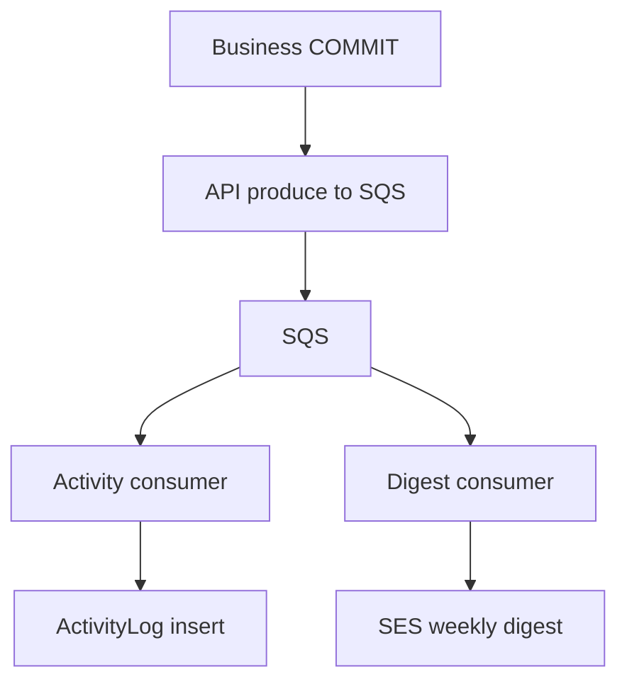

# Flows

Mermaid fenced blocks **render as diagrams on GitHub** when you open the file on github.com (blob view, PRs, and the rendered README). They also render in GitHub’s markdown preview and in most IDE previews (including Cursor/VS Code). They do **not** render in the raw text view, `git show`, or a plain clone without a Mermaid-aware viewer.

GitHub-safe shapes used here: `flowchart` and `sequenceDiagram`. Avoid click handlers and HTML inside nodes — GitHub strips those.

## AWS system design (design only)

Local run has no broker. On AWS the API stays a modular monolith; side effects leave the request path through SQS.

## Login and session cap

## Member submits a response

Same week + same answers: 200 existing row, no second activity.
Same week + different answers: 409.

## Manager weekly summary

## Cross-tenant denied

## Soft-delete user

## Produce and consume: activity plus email digest (AWS design)

After the business transaction commits, the API **produces** one small message and returns. Workers **consume**. The request never waits for persist or SES.

Payload allowlist is the same as today: `{ entityType, entityId, name }` plus `orgId`, `userId`, `group`, `action`. No tokens, hashes, or emails in the queue body. Digest mail is completion counts only — not another member’s answers.

